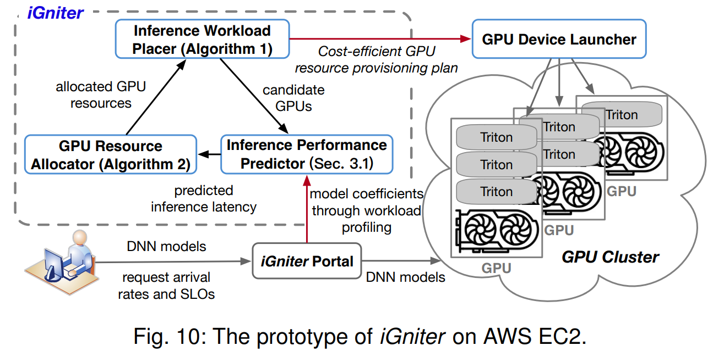
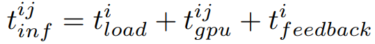
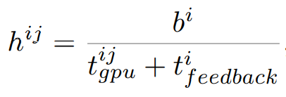
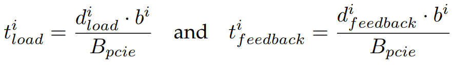
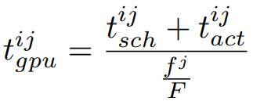
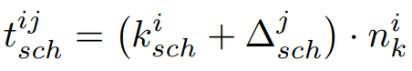
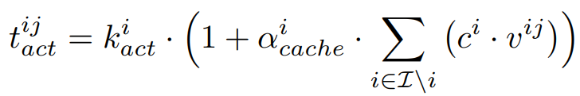

# iGniter
iGniter, an interference-aware GPU resource provisioning framework for achieving predictable performance of DNN inference in the cloud. 

## Prototype of iGniter

Our iGniter framework comprises three pieces of modules: an inference workload placer and a GPU resource allocator as well as an inference performance predictor. With the profiled model coefficients, the inference performance predictor first estimates the inference latency using our performance model. It then guides our GPU resource allocator and inference workload placer to identify an appropriate GPU device with the least performance interference and the guaranteed SLOs from candidate GPUs for each inference workload. According to the cost-efficient GPU resource provisioning plan generated by our algorithm, the GPU device launcher finally builds a GPU cluster and launches the Triton inference serving process for each DNN inference workload on the provisioned GPU devices.



## Model the Inference Performance
The execution of DNN inference on the GPU can be divided into three sequential steps: data loading, GPU execution, and result feedback. Accordingly, the DNN inference latency can be calculated by summing up the data loading latency, the GPU execution latency, and the result feedback latency, which is formulated as

<div align=center></div>

To improve the GPU resource utilization, the data loading phase overlaps with the GPU execution and result feedback phases in the mainstream DNN inference servers (e.g., Triton). Accordingly, we estimate the DNN inference throughput as 

<div align=center></div>

We calculate the data loading latency and the result feedback latency as

<div align=center></div>

The GPU execution phase consists of the GPU scheduling delay and kernels running on the allocated SMs. Furthermore, the performance interference can be caused by the reduction of GPU frequency due to the inference workload co-location, which inevitably prolongs the GPU execution phase. Accordingly, we formulate the GPU execution latency as 

<div align=center></div>

The GPU scheduling delay is roughly linear to the number of kernels for a DNN inference workload and there is increased scheduling delay caused by the performance interference on the GPU resource scheduler, which can be estimated as 

<div align=center></div>

Given a fixed supply of L2 cache space on a GPU device, a higher GPU L2 cache utilization (i.e., demand) indicates severer contention on the GPU L2 cache space, thereby resulting in a longer GPU active time. Accordingly, we estimate the GPU active time as 

<div align=center></div>


## Getting Started

### Requirements
```bash
cd i-Gniter
python3 -m pip install --upgrade pip
pip install -r requirements.txt
```
### Downloading Docker Image From NGC

We use the Triton as our inference server. Before you can use the Triton Docker image you must install Docker. In order to use a GPU for inference, you must also install the [NVIDIA Container Toolkit](https://github.com/NVIDIA/nvidia-docker).

```bash
docker pull nvcr.io/nvidia/tritonserver:21.07-py3
docker pull nvcr.io/nvidia/tritonserver:21.07-py3-sdk
```

### Downloading Model Files

Running the script to download the model files. By the way, the models downloaded via `fetch_models.sh` are generated under V100, if the GPU is not V100 then the models need to be regenerated. 

```
cd i-Gniter/Launch/model/
./fetch_models.sh
```

### Real Input Data

You can provide data to be used with every inference request made by program in a JSON file. The program will use the provided data in a round-robin order when sending inference requests. Skip this section if you want to use random data for inference, otherwise run the following command to generate JSON files from a set of real pictures. You need to prepare your own real pictures. In the addition, the name of JSON files need to be the same as your model name.

```
cd i-Gniter/Launch
python3 data_transfer.py -c 1000 -d /your/pictures/directory -f resnet50_dynamic.json -k actual_input_resnet50 -s 3:224:224
python3 data_transfer.py -c 1000 -d /your/pictures/directory -f vgg19_dynamic.json    -k actual_input_vgg19    -s 3:224:224
python3 data_transfer.py -c 1000 -d /your/pictures/directory -f alexnet_dynamic.json  -k actual_input_alexnet  -s 3:224:224
python3 data_transfer.py -c 558  -d /your/pictures/directory -f ssd_dynamic.json      -k actual_input_ssd      -s 3:300:300
```

### Profiler

The profiler is only tested on T4 and V100 now. If you want to use it on other GPUs, you may need to pay attention to the hardware parameters such as `activetime_2` , `activetime_1` and ` idletime_1`. If the GPU is V100, you can skip this part. We have already provided a config file profiled on the V100.

#### Profiling environment

* Driver Version: 470
* CUDA Version: 11.3 
* TensorRT Version: 8.0.1.6
* cuDNN Version: 8.2.0

#### Generating models:

~~~shell
cd i-Gniter/Profile
python3 model_onnx.py 
./onnxTOtrt.sh
~~~

#### Initializing:

~~~shell
source start.sh
~~~

#### Profiling hardware parameters:

~~~bash
cd tools
python3 computeBandwidth.py
./power_t_freq 1530 # 1530 is the highest frequency of the V100 GPU
# 1590 is the highest frequency of the T4 GPU
./coninference
~~~

#### Profiling model parameters:

~~~bash
python3 getDataSize.py # Getting the input and output size of different models.
# Computing the kernel of different models.
./l2cache alexnet 
./l2cache resnet50
./l2cache ssd
./l2cache vgg19
# Computing the model parameters.
./soloinference alexnet
./soloinference resnet50
./soloinference ssd
./soloinference vgg19
./multiinference alexnet
./multiinference resnet50
./multiinference ssd
./multiinference vgg19
./recordpower.sh alexnet
./recordpower.sh resnet50
./recordpower.sh ssd
./recordpower.sh vgg19
./model_l2caches.sh alexnet
./model_l2caches.sh resnet50
./model_l2caches.sh ssd
./model_l2caches.sh vgg19 
~~~

#### Copying config to Algorithm directory

~~~
cp config ../../Algorithm/config
~~~

The configured file is shown in `i-Gniter/Algorithm/config`, which is the result of running on the V100 GPU.


### Performance Measurement Tool

If you do not want to run the whole system, you can just use this tool to evaluate the placement configuration generated by the `igniter-algorithm.py`. 

If you want to use the random data,
```
python3 evaluation.py -t 10 -c ../Algorithm/config_gpu1.json
```
If you want to use real data,
```
python3 evaluation.py -i ./input_data -t 10 -c ../Algorithm/config_gpu1.json
```

#### Understanding the Results
After the program runs, the information and running results of each model will be output on the screen. 
```
alexnet_dynamic:
[gpu_resource, batch, throughout_per_second, gpu_latency_ms, slo_vio]: 
[10.0%, 4, 500.0, 6.612, 0.05%]

resnet50_dynamic:
[gpu_resource, batch, throughout_per_second, gpu_latency_ms, slo_vio]: 
[30.0%, 8, 400.0, 18.458, 0.01%]

vgg19_dynamic:
[gpu_resource, batch, throughout_per_second, gpu_latency_ms, slo_vio]: 
[37.5%, 6, 199.2, 27.702, 0.0%]
```


### iGniter System

#### Start the iGniter server

```bash
cd i-Gniter/Algorithm
python3 start.py -f 1590 -p 300 -s 80 # (1590,300,80) is the config of V100 GPU. 
python3 iGniterPortal.py 
```

After you run the script, the iGniter server has been started and is listening for client requests.

#### Start the iGniter client

~~~bash
cd i-Gniter/Launch
python3 iGniterClientWrapper.py # You can pass “-m” to set the model request configuration
~~~

After you run the script, the iGniter client is started and will send requests to the iGniter server.

After the client sends the request, the server processes the request and generates a GPU resource provisioning plan, which is a JSON config file. The configuration will specify models, inference arrival rates, SLOs, GPU resources, and batches. 

The JSON config file is shown below, and the file is placed in the `i-Gniter/Algorithm` directory.

```json
{
  "models": ["alexnet_dynamic", "resnet50_dynamic", "vgg19_dynamic"], 
  "rates": [500, 400, 200], 
  "slos": [7.5, 20.0, 30.0], 
  "resources": [10.0, 30.0, 37.5], 
  "batches": [4, 8, 6]
}
```


## Publication

Fei Xu, Jianian Xu, Jiabin Chen, Li Chen, Ruitao Shang, Zhi Zhou, Fangming Liu, "[iGniter: Interference-Aware GPU Resource Provisioning for Predictable DNN Inference in the Cloud](https://ieeexplore.ieee.org/document/10002315)," IEEE Transactions on Parallel and Distributed Systems, 2023, 34(3): 812-827. DOI: 10.1109/TPDS.2022.3232715.

We have also uploaded our paper to [arxiv](https://arxiv.org/abs/2211.01713), and we would encourage anybody interested in our work to cite our paper. Our paper has been published in IEEE TPDS, and we change the bibliography as below.

```
@article{xu2023igniter,
  title={iGniter: Interference-Aware GPU Resource Provisioning for Predictable DNN Inference in the Cloud},
  author={Xu, Fei and Xu, Jianian and Chen, Jiabin and Chen, Li and Shang, Ruitao and Zhou, Zhi and Liu, Fangming},
  journal={IEEE Transactions on Parallel \& Distributed Systems},
  volume={34},
  number={03},
  pages={812--827},
  year={2023},
  publisher={IEEE Computer Society}
}
```
