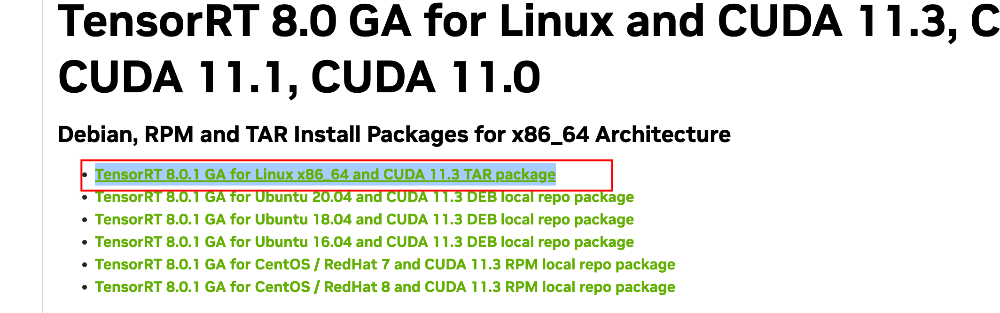
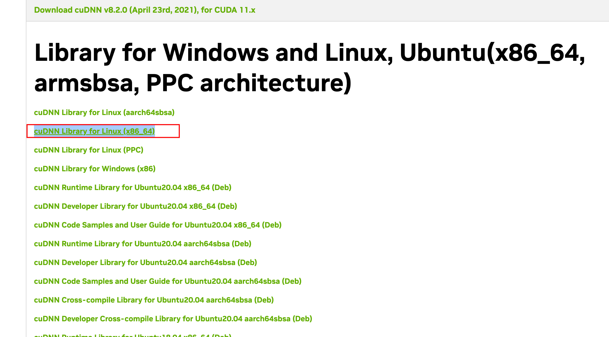
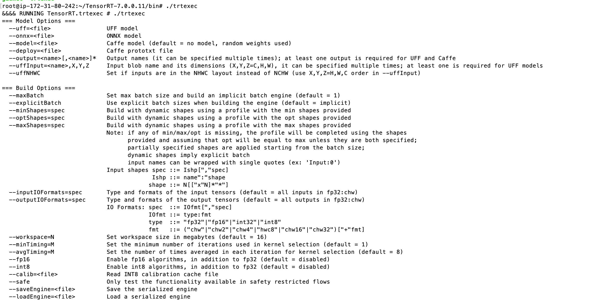

# iGniter
iGniter, an interference-aware GPU resource provisioning framework for achieving predictable performance of DNN inference in the cloud. 

## Prototype of iGniter

Our iGniter framework comprises three pieces of modules: an inference workload placer and a GPU resource allocator as well as an inference performance predictor. With the profiled model coefficients, the inference performance predictor first estimates the inference latency using our performance model. It then guides our GPU resource allocator and inference workload placer to identify an appropriate GPU device with the least performance interference and the guaranteed SLOs from candidate GPUs for each inference workload. According to the cost-efficient GPU resource provisioning plan generated by our algorithm, the GPU device launcher finally builds a GPU cluster and launches the Triton inference serving process for each DNN inference workload on the provisioned GPU devices.


## Model the Inference Performance
The execution of DNN inference on the GPU can be divided into three sequential steps: data loading, GPU execution, and result feedback. Accordingly, the DNN inference latency can be calculated by summing up the data loading latency, the GPU execution latency, and the result feedback latency, which is formulated as

$t_{i n f}^{i j}=t_{l o a d}^{i}+t_{g p u}^{i j}+t_{f e e d b a c k}^{i}$

To improve the GPU resource utilization, the data loading phase overlaps with the GPU execution and result feedback phases in the mainstream DNN inference servers (e.g., Triton). Accordingly, we estimate the DNN inference throughput as 

$h^{i j}=b^{i} / (t_{g p u}^{i j}+t_{f e e d b a c k}^{i})$


We calculate the data loading latency and the result feedback latency as

$t_{load}^{i}=(d_{load}^{i} \cdot b^{i}) / B_{pcie} \quad$ and $\quad t_{feedback}^{i}=(d_{feedback}^{i} \cdot b^{i}) / B_{pcie}$


The GPU execution phase consists of the GPU scheduling delay and kernels running on the allocated SMs. Furthermore, the performance interference can be caused by the reduction of GPU frequency due to the inference workload co-location, which inevitably prolongs the GPU execution phase. Accordingly, we formulate the GPU execution latency as 

$t_{g p u}^{i j}=(t_{s c h}^{i j}+t_{a c t}^{i j}) / (f^{j} / F)$

The GPU scheduling delay is roughly linear to the number of kernels for a DNN inference workload and there is increased scheduling delay caused by the performance interference on the GPU resource scheduler, which can be estimated as 

$t_{s c h}^{i j}=\left(k_{s c h}^{i}+\Delta_{s c h}^{j}\right) \cdot n_{k}^{i}$

Given a fixed supply of L2 cache space on a GPU device, a higher GPU L2 cache utilization (i.e., demand) indicates severer contention on the GPU L2 cache space, thereby resulting in a longer GPU active time. Accordingly, we estimate the GPU active time as 

$t_{\text {act }}^{i j}=k_{\text {act }}^{i} \cdot\left(1+\alpha_{\text {cache }}^{i} \cdot \sum_{i \in \mathcal{I} \backslash i}\left(c^{i} \cdot v^{i j}\right)\right)$


## Dependencies and Requirements

* Description of required hardware resources:
  - We set up a GPU cluster of 10 p3.2xlarge EC2 instances, each equipped with 1 NVIDIA V100 GPU card, 8 vCPUs, and 61 GB memory.
* Description of the required operating system:
  - Ubuntu 18.04
* Required software libraries: Triton, NVIDIA Driver, cuDNN, CUDA, Python3, TensorRT, Docker, NVIDIA Container Toolkit, Torchvision, Torch, Pandas, Scikit-image, Numpy, Scipy, Pillow.
* Input dataset required for executing code or generating input data: ImageNet dataset and VOC2012 dataset.


## Installation and Deployment Process

* Installation of Libraries and Software:

  - Install Python3 pip.

    ```bash
    apt-get update
    sudo apt install python3-pip
    python3 -m pip install --upgrade pip
    ```

  - Install NVIDIA Driver.

    ```bash
    sudo add-apt-repository ppa:graphics-drivers/ppa 
    sudo apt-get update 
    sudo apt install nvidia-driver-470 # Install version 470 driver 
    sudo reboot 
    ```

  - Install CUDA [Note: Do Not Install Driver].

    ```bash
    wget https://developer.download.nvidia.com/compute/cuda/11.3.0/local_installers/cuda_11.3.0_465.19.01_linux.run
    sudo sh cuda_11.3.0_465.19.01_linux.run
    ```

  * Install TensorRT.

    

    ~~~bash
    version="8.0.1.6"
    tar xzvf tensorrt-8.0.1.6.linux.x86_64-gnu.cuda-11.3.cudnn8.2.tar.gz
    pos=$PWD
    cd ${pos}/TensorRT-${version}/python
    sudo pip3 install tensorrt-*-cp36-none-linux_x86_64.whl # Because I downloaded python version 3.6, it is cp36
    cd ${pos}/TensorRT-${version}/uff
    sudo pip3 install uff-0.6.5-py2.py3-none-any.whl # Refer to the specific name of the file in this directory
    cd ${pos}/TensorRT-${version}/graphsurgeon
    sudo pip3 install graphsurgeon-0.4.1-py2.py3-none-any.whl # Refer to the specific name of the file in this directory
    ~~~

  * Install cuDNN.

    

    ~~~bash
    tar -xzvf cudnn-11.3-linux-x64-v8.2.0.53.tgz # Refer to the specific name of the file in this directory
    cudnnversion="11.3"
    sudo cp cuda/include/cudnn.h /usr/local/cuda-${cudnnversion}/include
    sudo cp cuda/lib64/libcudnn* /usr/local/cuda-${cudnnversion}/lib64
    sudo chmod a+r /usr/local/cuda-${cudnnversion}/include/cudnn.h 
    sudo chmod a+r /usr/local/cuda-${cudnnversion}/lib64/libcudnn*
    ~~~

  * Configure `~/.bashrc` .

    ~~~bash
    export LD_LIBRARY_PATH=$LD_LIBRARY_PATH:/usr/local/cuda-11.3/lib64:/root/TensorRT-8.0.1.6/lib
    export PATH=$PATH:/usr/local/cuda-11.3/bin:/root/TensorRT-8.0.1.6/bin
    export CUDA_HOME=$CUDA_HOME:/usr/local/cuda-11.3
    ~~~

  * Test if `trtexc` install successful.

    ~~~bash
    trtexec # The following message appears to indicate a successful installation.
    ~~~

    

  * Install docker.

    ~~~bash
    apt install docker.io
    ~~~

  * Install NVIDIA Container Toolkit.

    ~~~bash
    distribution=$(. /etc/os-release;echo $ID$VERSION_ID) \
       && curl -s -L https://nvidia.github.io/nvidia-docker/gpgkey | sudo apt-key add - \
       && curl -s -L https://nvidia.github.io/nvidia-docker/$distribution/nvidia-docker.list | sudo tee /etc/apt/sources.list.d/nvidia-docker.list
    curl -s -L https://nvidia.github.io/nvidia-container-runtime/experimental/$distribution/nvidia-container-runtime.list | sudo tee /etc/apt/sources.list.d/nvidia-container-runtime.list
    sudo apt-get update
    sudo apt-get install -y nvidia-docker2
    sudo systemctl restart docker
    sudo docker run --rm --gpus all nvidia/cuda:11.0.3-base-ubuntu20.04 nvidia-smi
    ~~~

* Deployment of Code:

  * Pull iGniter code.

    ~~~bash
    git clone https://github.com/Echozqn/igniter.git
    cd igniter/i-Gniter
    pip install -r requirements.txt
    ~~~

  * Pull triton images.

    ~~~bash
    docker pull nvcr.io/nvidia/tritonserver:21.07-py3
    docker pull nvcr.io/nvidia/tritonserver:21.07-py3-sdk
    ~~~

  * Convert model.

    * If you are using V100, we have prepared the model files required for your experiments. Please perform the following actions.

      * Download the model file.

        ~~~bash
        cd i-Gniter/Launch/model/
        ./fetch_models.sh
        ~~~

    * If not, you need to follow the steps below to generate the model files needed for the experiment.

      * Use the `trtexec` tool to convert the ONNX to a trt engine model.

        ~~~bash
        cd i-Gniter/Launch/model/
        ./fetch_models.sh
        cd i-Gniter/Profile
        python3 model_onnx.py # Generate Model
        sh onnxTOtrt.sh # Convert model
        ~~~

      * Replace `model.plan` in the `$path/igniter/i-Gniter/Launch/model/model` directory with the generated model, the directory structure is shown below.

        ~~~
        .
        └── igniter
            └── i-Gniter
                └── Launch
                    └── model
                        └── model
                            ├── alexnet_dynamic
                            │   ├── 1
                            │   │   └── model.plan
                            │   └── config.pbtxt
                            ├── resnet50_dynamic
                            │   ├── 1
                            │   │   └── model.plan
                            │   └── config.pbtxt
                            ├── ssd_dynamic
                            │   ├── 1
                            │   │   └── model.plan
                            │   └── config.pbtxt
                            └── vgg19_dynamic
                                ├── 1
                                │   └── model.plan
                                └── config.pbtxt
        ~~~

      * Modify the input and output name in the configuration files (`config.pbtxt`) of the four models.The inputs name are modified to `actual_input_1` and the outputs name to `output1`.

        Here is the `config.pbtxt` file for the alexnet model.

        ~~~txt
        name: "alexnet_dynamic"
        platform: "tensorrt_plan"
        max_batch_size: 5
        dynamic_batching {
        preferred_batch_size: [5]
          max_queue_delay_microseconds: 100000
        }
        input [
        {
          name: "actual_input_alexnet"
          data_type: TYPE_FP32
          dims: [3, 224, 224]
        }
        ]
        output [
        {
          name: "output_alexnet"
          data_type: TYPE_FP32
          dims: [1000]
        }
        ]
        ~~~


## Getting Started

### Profiler

The profiler is only tested on T4 and V100 now. If you want to use it on other GPUs, you may need to pay attention to the hardware parameters such as `activetime_2` , `activetime_1` and ` idletime_1`. If the GPU is V100, you can skip this part. We have already provided a config file profiled on the V100.

#### Initializing:

~~~shell
source start.sh
~~~

#### Profiling hardware parameters:

~~~bash
cd tools
python3 computeBandwidth.py
./power_t_freq 1530 # 1530 is the highest frequency of the V100 GPU
# 1590 is the highest frequency of the T4 GPU
python3 start.py -f 1590 -p 300 -s 80 # (1590,300,80) is the config of V100 GPU. 
./coninference
~~~

#### Profiling model parameters:

~~~bash
python3 getDataSize.py # Getting the input and output size of different models.
# Computing the kernel of different models.
./l2cache alexnet 
./l2cache resnet50
./l2cache ssd
./l2cache vgg19
# Computing the model parameters.
./soloinference alexnet
./soloinference resnet50
./soloinference ssd
./soloinference vgg19
./multiinference alexnet
./multiinference resnet50
./multiinference ssd
./multiinference vgg19
./recordpower.sh alexnet
./recordpower.sh resnet50
./recordpower.sh ssd
./recordpower.sh vgg19
./model_l2caches.sh alexnet
./model_l2caches.sh resnet50
./model_l2caches.sh ssd
./model_l2caches.sh vgg19 
~~~

#### Copying config to Algorithm directory

~~~
cp config ../../Algorithm/config
~~~

The configured file is shown in `i-Gniter/Algorithm/config`, which is the result of running on the V100 GPU.


### Performance Measurement Tool

#### Real Input Data

You can provide data to be used with every inference request made by program in a JSON file. The program will use the provided data in a round-robin order when sending inference requests. Skip this section if you want to use random data for inference, otherwise run the following command to generate JSON files from a set of real pictures. You need to prepare your own real pictures. In the addition, the name of JSON files need to be the same as your model name.

```
cd i-Gniter/Launch
python3 data_transfer.py -c 1000 -d /your/pictures/directory -f resnet50_dynamic.json -k actual_input_resnet50 -s 3:224:224
python3 data_transfer.py -c 1000 -d /your/pictures/directory -f vgg19_dynamic.json    -k actual_input_vgg19    -s 3:224:224
python3 data_transfer.py -c 1000 -d /your/pictures/directory -f alexnet_dynamic.json  -k actual_input_alexnet  -s 3:224:224
python3 data_transfer.py -c 558  -d /your/pictures/directory -f ssd_dynamic.json      -k actual_input_ssd      -s 3:300:300
```

#### Evaluation

If you do not want to run the whole system, you can just use this tool to evaluate the placement configuration generated by the `igniter-algorithm.py`. 

If you want to use the random data,
```
python3 evaluation.py -t 10 -c ../Algorithm/config_gpu1.json
```
If you want to use real data,
```
python3 evaluation.py -i ./input_data -t 10 -c ../Algorithm/config_gpu1.json
```

#### Understanding the Results
After the program runs, the information and running results of each model will be output on the screen. 
```
alexnet_dynamic:
[gpu_resource, batch, throughout_per_second, gpu_latency_ms, slo_vio]: 
[10.0%, 4, 500.0, 6.612, 0.05%]

resnet50_dynamic:
[gpu_resource, batch, throughout_per_second, gpu_latency_ms, slo_vio]: 
[30.0%, 8, 400.0, 18.458, 0.01%]

vgg19_dynamic:
[gpu_resource, batch, throughout_per_second, gpu_latency_ms, slo_vio]: 
[37.5%, 6, 199.2, 27.702, 0.0%]
```


### iGniter System

#### Start the iGniter server

```bash
cd i-Gniter/Algorithm
python3 iGniterPortal.py 
```

After you run the script, the iGniter server has been started and is listening for client requests.

#### Start the iGniter client

~~~bash
cd i-Gniter/Launch
python3 iGniterClientWrapper.py # You can pass “-m” to set the model request configuration
~~~

After you run the script, the iGniter client is started and will send requests to the iGniter server.

After the client sends the request, the server processes the request and generates a GPU resource provisioning plan, which is a JSON config file. The configuration will specify models, inference arrival rates, SLOs, GPU resources, and batches. 

The JSON config file is shown below, and the file is placed in the `i-Gniter/Algorithm` directory.

```json
{
  "models": ["alexnet_dynamic", "resnet50_dynamic", "vgg19_dynamic"], 
  "rates": [500, 400, 200], 
  "slos": [7.5, 20.0, 30.0], 
  "resources": [10.0, 30.0, 37.5], 
  "batches": [4, 8, 6]
}
```


## Reproducibility of Experiments

### Experiment 1: Verification of Inference Latency Prediction Accuracy under Different GPU Resources

First, we need to measure the inference latency of two models, VGG-19 and SSD, under four different resource allocation scenarios. The batch size of both models is set to 3. The four resource allocation scenarios are 20%, 40%, 60% and 80% of the resources for VGG-19, and the remaining resources for SSD.

The specific experimental steps are as follows:

1. We use Triton Server to directly measure the inference latency when the two models are co-located, and record the respective measurement results.

2. We use the iGniter prediction algorithm to predict the inference latency, input four cases, and ignore the tuning process of the algorithm to get the respective prediction results.

3. We use the DNN latency prediction model of gpu-lets+ to predict the inference latency, input four cases, and ignore the tuning process of the algorithm to obtain the respective prediction results.

Finally, we plot the results obtained by the three strategies and present them in graphical form as shown in Figure 11.

### Experiment 2:Verification of Inference Latency Prediction Accuracy with Different Batch Sizes

In this experiment, the inference latencies of two models (VGG-19 and SSD) with different batch size settings under three different strategies need to be measured. In this experiment, the resource allocation is set to 50% for VGG-19 and 50% for SSD. The four batch size settings are VGG-19:SSD = (1, 1), VGG-19:SSD = (3, 3), VGG-19:SSD = (9, 9), and VGG-19:SSD = (27, 27).

1. We use Triton Server to measure the inference latency when the two models are co-located.
2. We input these four cases directly into the iGniter prediction algorithm to obtain the predicted inference latencies when the two models are co-located, ignoring the tuning process of the algorithm.
3. We input these four cases into the DNN latency prediction model of gpu-lets+ to obtain the predicted inference latency when the two models are co-located, ignoring the adjustment process of this algorithm.

Finally, we graph the results obtained from the three strategies, as shown in Figure 12.

### Experiment 3: Verification of Inference Latency Prediction Accuracy with More (4+) Inference workloads Co-Located

To compare the difference between the inference latencies predicted using iGniter at co-location and the actual inference latencies observed for the AlexNet, ResNet-50, VGG-19, and SSD models, we took the following steps:

1. Experimental setup: Fix the GPU resources of the four models to 25% and the batch size to 3.
2. Measurement of inference latency: Use Triton Server to measure the inference latency when these four models are co-located separately, ignoring the tuning process of the algorithm.
3. Prediction of inference latency: Use iGniter's prediction algorithm to predict the inference latency when the four models are co-located, ignoring the tuning process of the algorithm.
4. Presentation of results: The results obtained from the two strategies are plotted in a graph for comparison and analysis. Figure 13 shows the results.

### Experiment 4: Verification of iGniter's Ability to Ensure DNN Inference Latency SLO

Experimental setup: We set Service Level Objectives (SLOs) for the SSD model and the VGG-19 model, where the SSD model has an SLO latency of 25 ms and a request rate of 150 req/sec, and the VGG-19 model has an SLO latency of 40 ms and a request rate of 200 req/sec. We deployed both models together.

iGniter measurements: After performing the model setup, we started iGniter's portal and continued the measurements for 60 seconds. During these 60 seconds of measurements, we recorded the inference latency and request throughput of the SSD model, and recorded the GPU resource allocation and batch size configuration of the SSD model under the iGniter policy.

GSLICE+ measurements: Again, after performing the model setup, we launched the GSLICE+ algorithm script and continued the measurements for 60 seconds. During these 60 seconds of measurements, we recorded the inference latency and request throughput of the SSD model, and recorded the GPU resource allocation and batch size configuration of the SSD model under the GSLICE+ policy.

Results plotting: We plot the inference latency and request throughput of the SSD model obtained from the iGniter policy and GSLICE+ policy measurements as Figure 15, and the GPU resource and batch size configurations of the SSD model recorded by the two policies as Figure 16. finally, we perform a comparative analysis of the effects of the two policies.

### Experiment 5: Handling Latency Prediction Error in Inference

Experimental settings: The following settings were applied to the three models, AlexNet, ResNet-50 and SSD: for AlexNet, we set its SLO latency to 10 ms and request rate to 1200 req/sec; for ResNet-50, we set its SLO latency to 30 ms and request rate to 600 req/sec; for SSD, we set its SLO latency was set to 40 ms and request rate to 50 requests/sec.

Next, we launched the iGniter Portal and entered the above model settings. After running continuously for 20 seconds, we collected the P99 latency data for the process. We found that the GPU resources allocated by the iGniter prediction algorithm for AlexNet could not meet its latency SLO requirement with this setup, i.e., the P99 latency for the first second was 15.6 ms, which exceeded its SLO (i.e., 10 ms).

After this occurred, iGniter's prediction error handling mechanism was triggered. At 1.5 seconds, iGniter switches the inference workload that violates the SLO to the shadow Triton process that allocates more GPU resources.

Finally, we plotted the collected P99 latency data over 20 seconds together with AlexNet's SLO into a time-latency graph (e.g., Figure 17) to evaluate the effect of iGniter's resource allocation.

### Experiment 6: Optimizing the DNN Inference Cost

First, we need to start 12 workloads and record GPU resource configurations using the gpu-lets+, FFD+, GSLICE+, and iGniter configuration policies, respectively.

Specifically, for each configuration policy, we need to:

1. Enter the configurations of the 12 workloads into the corresponding algorithm scripts or iGniter Portal;
2. Launch the script or iGniter Portal;
3. Wait for the algorithm to adjust;
4. Record the GPU resources allocated to these 12 workloads after stabilization;
5. Record the placement scheme of the W2 inference load.

Finally, the GPU resources assigned to the 12 workloads after stabilization recorded by the four configuration policies are plotted in Figure 18, while the placement scheme of the W2 inference load recorded by the four configuration policies is plotted in Figure 19.

### Experiment 7: iGniter Performance in Heterogeneous Clusters 

The specific steps are shown below:

1. Start the 12 workloads in TABLE 3 simultaneously. Provide 15 g4dn.xlarge instances (T4 GPUs) and 6 p3.2xlarge instances (V100 GPUs) as resources for this cluster.

2. Use the Profile tool to measure the relevant parameters of the T4 GPUs.

3. Launch iGniter Portal, perform resource allocation, and record the placement scheme for the 12 workloads.

Finally, plot the placement scheme as a graph, Fig. 20.

### Experiment 8: Runtime Overhead of iGniter

The specific steps are as follows:

1. Set the number of model workloads.
2. Start iGniter's `algorithm-igniter.py`.
3. Record the memory and computational overhead of the iGniter algorithm.
4. Repeat steps 1-3 with the number of model workloads ranging from 10 to 1000.
5. Collect the recorded data and plot it as Figure 21.


## Publication

Fei Xu, Jianian Xu, Jiabin Chen, Li Chen, Ruitao Shang, Zhi Zhou, Fangming Liu, "[iGniter: Interference-Aware GPU Resource Provisioning for Predictable DNN Inference in the Cloud](https://ieeexplore.ieee.org/document/10002315)," IEEE Transactions on Parallel and Distributed Systems, 2023, 34(3): 812-827. DOI: 10.1109/TPDS.2022.3232715.

We have also uploaded our paper to [arxiv](https://arxiv.org/abs/2211.01713), and we would encourage anybody interested in our work to cite our paper. Our paper has been published in IEEE TPDS, and we change the bibliography as below.

```
@article{xu2023igniter,
  title={iGniter: Interference-Aware GPU Resource Provisioning for Predictable DNN Inference in the Cloud},
  author={Xu, Fei and Xu, Jianian and Chen, Jiabin and Chen, Li and Shang, Ruitao and Zhou, Zhi and Liu, Fangming},
  journal={IEEE Transactions on Parallel \& Distributed Systems},
  volume={34},
  number={03},
  pages={812--827},
  year={2023},
  publisher={IEEE Computer Society}
}
```
